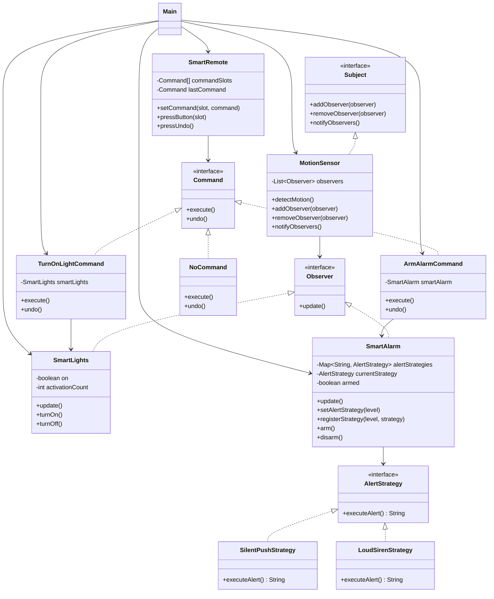

# OmniHome-Behavioral-System

## Overview

This project implements the OmniHome behavioral system using three design patterns:

- Observer Pattern
- Strategy Pattern
- Command Pattern

The system allows a motion sensor to notify multiple smart devices, lets the smart alarm switch alert behavior at runtime, and provides a remote control with undo support.

## Technologies

- Java 17+
- Gradle
- JUnit 5

## Project Structure

```text
OmniHome-Behavioral-System/
├── build.gradle
├── settings.gradle
├── gradlew
├── gradlew.bat
├── gradle/
│   └── wrapper/
├── src/
│   ├── main/
│   │   └── java/
│   │       └── com/
│   │           └── omnihome/
│   │               ├── Main.java
│   │               ├── command/
│   │               │   ├── ArmAlarmCommand.java
│   │               │   ├── Command.java
│   │               │   ├── NoCommand.java
│   │               │   ├── SmartRemote.java
│   │               │   └── TurnOnLightCommand.java
│   │               ├── observer/
│   │               │   ├── MotionSensor.java
│   │               │   ├── Observer.java
│   │               │   ├── SmartAlarm.java
│   │               │   ├── SmartLights.java
│   │               │   └── Subject.java
│   │               └── strategy/
│   │                   ├── AlertStrategy.java
│   │                   ├── LoudSirenStrategy.java
│   │                   └── SilentPushStrategy.java
│   └── test/
│       └── java/
│           └── com/
│               └── omnihome/
│                   ├── CommandPatternTest.java
│                   ├── MainSimulationTest.java
│                   ├── ObserverPatternTest.java
│                   └── StrategyPatternTest.java
└── README.md
```

## UML Diagram



## How to Run

The project includes the Gradle Wrapper, so Gradle does not need to be installed on the machine.

### Windows PowerShell

Run all checks and the main simulation:

```powershell
.\gradlew.bat clean test run build
```

Run tests only:

```powershell
.\gradlew.bat test
```

Run the main program only:

```powershell
.\gradlew.bat run
```

### macOS / Linux

Run all checks and the main simulation:

```bash
./gradlew clean test run build
```

Run tests only:

```bash
./gradlew test
```

Run the main program only:

```bash
./gradlew run
```

## Manual Java Run

If you want to compile and run the main program without Gradle:

### Windows PowerShell

```powershell
New-Item -ItemType Directory -Force out
javac -d out src\main\java\com\omnihome\Main.java src\main\java\com\omnihome\observer\*.java src\main\java\com\omnihome\strategy\*.java src\main\java\com\omnihome\command\*.java
java -cp out com.omnihome.Main
```

JUnit tests are managed through Gradle, so the recommended way to run tests is with the wrapper commands above.

## Expected Output

Example output from the main simulation:

```text
Testing Event Bus & Strategy
Motion detected by sensor.
Smart lights turned on.
Sending silent push notification to homeowner's phone.
Motion detected by sensor.
Smart lights turned on.
SOUNDING 120dB SIREN!
Testing Remote & Command
Smart lights turned on.
Smart alarm armed.
Smart alarm disarmed.
```

## Class Responsibilities

### Main

- `Main`: Runs the full simulation required by the assignment.

### Observer Pattern

- `Subject`: Defines methods for registering, removing, and notifying observers.
- `Observer`: Defines the `update()` contract for all subscribed devices.
- `MotionSensor`: Concrete subject that broadcasts motion events to all attached observers.
- `SmartLights`: Concrete observer that reacts to motion and can also be controlled by commands.
- `SmartAlarm`: Concrete observer that reacts to motion and also acts as the strategy context for alert behavior.

### Strategy Pattern

- `AlertStrategy`: Defines the alert behavior interface.
- `SilentPushStrategy`: Sends a silent phone notification.
- `LoudSirenStrategy`: Triggers the loud siren alert.

### Command Pattern

- `Command`: Defines the `execute()` and `undo()` operations.
- `TurnOnLightCommand`: Encapsulates the action of turning on the lights and undoing it by turning them off.
- `ArmAlarmCommand`: Encapsulates the action of arming the alarm and undoing it by disarming it.
- `NoCommand`: Default placeholder command for unused remote slots.
- `SmartRemote`: Stores commands in slots, executes button presses, and supports undo for the last action.

### Test Classes

- `ObserverPatternTest`: Verifies subscriptions, notifications, and observer removal.
- `StrategyPatternTest`: Verifies runtime strategy switching and registry behavior.
- `CommandPatternTest`: Verifies remote execution and undo.
- `MainSimulationTest`: Verifies the full required simulation flow.
